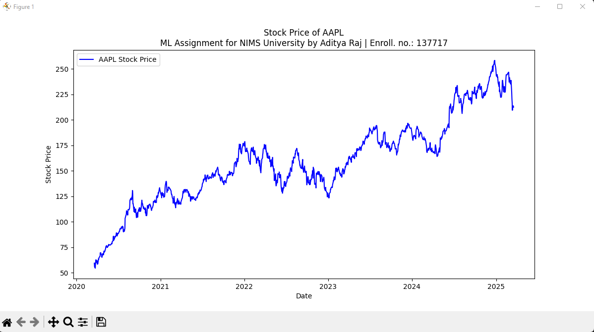
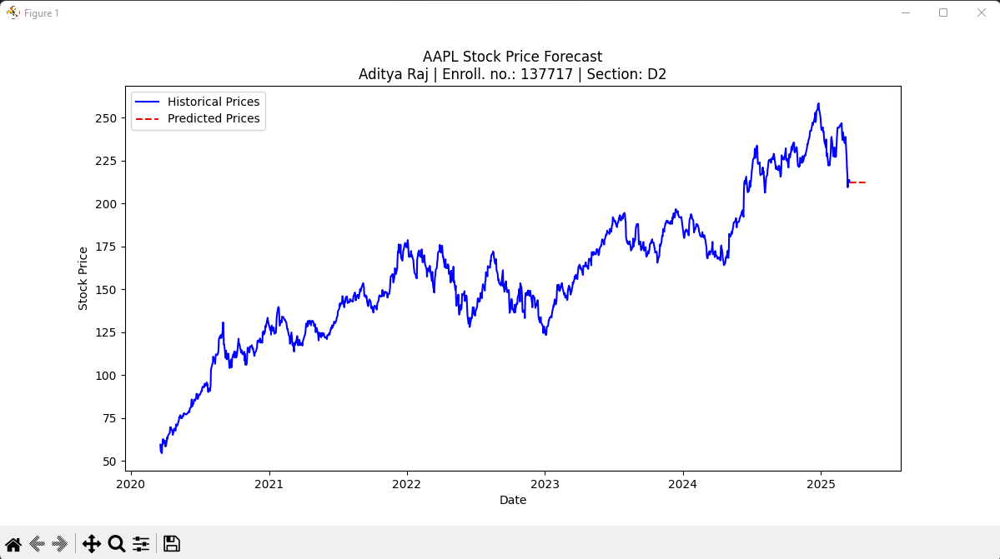

# 📊 Stock Price Forecasting with ARIMA

This project performs **historical analysis and time series forecasting** of stock prices using **ARIMA (AutoRegressive Integrated Moving Average)**. It fetches data using the Yahoo Finance API and visualizes both historical and predicted prices.

> 🔧 Created as a Machine Learning Assignment for **NIMS University**  
> 🎓 **By Aditya Raj** | Enrollment No.: 137717 | Section: D2

---

## 🧠 Features

- ✅ Fetch real-time historical stock price data via [yfinance](https://pypi.org/project/yfinance/)
- 📈 Plot and visualize closing prices
- 📉 Perform stationarity test using ADF (Augmented Dickey-Fuller)
- 🔁 Fit an ARIMA model for time series forecasting
- 📅 Predict and plot the next 30 business days of stock prices
- 📊 Beautiful Matplotlib visualizations

---

## 📸 Screenshots

### Historical Stock Price of AAPL


### Forecasted Stock Price


---

## 🧰 Technologies Used

- Python 3.x
- [pandas](https://pandas.pydata.org/)
- [matplotlib](https://matplotlib.org/)
- [yfinance](https://pypi.org/project/yfinance/)
- [statsmodels](https://www.statsmodels.org/)
- `warnings` and `datetime` (Python standard library)

---

## 🚀 Getting Started

### 🔧 Installation

1. Clone the repo:
   ```bash
   git clone https://github.com/educatedadi/Stock-price-analysis-and-prediction.git
   cd Stock-price-analysis-and-prediction
